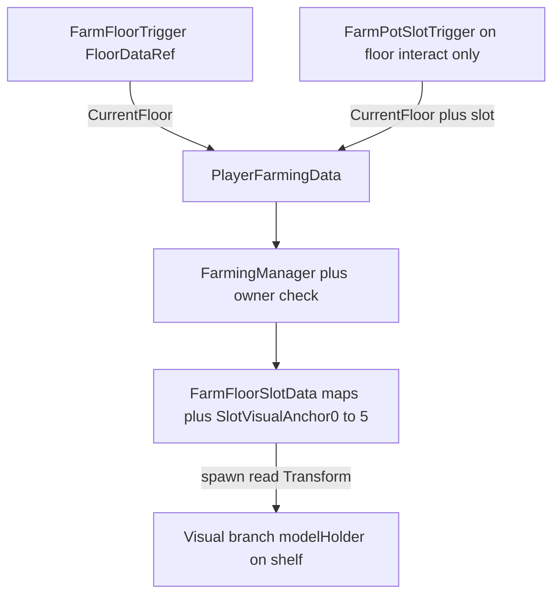

## Ràng buộc triển khai (code-only trước)

- **Không chỉnh** file **`*.asset`** và **`EditorGenLib.fcc` / `Temp/UGCLanguage/editorGen/*`** trong scope implement tự động.
- **Ưu tiên đổi code** (`.fcg` trong `Assets/Scripts/`) cho đến khi compile/logic ổn.
- **Ghi chú cho bạn** (trong PR mô tả hoặc section cuối plan): những việc **bắt buộc làm trong Craftland Studio** sau khi code xong, ví dụ:
  - Gắn graph/script mới vào entity (floor, 6 slot trigger, HUD widgets).
  - Đổi reference prefab nếu đổi tên component graph.
  - Thêm `consumable_btn` path trên HUD prefab, chỉnh visibility.
  - Prefab mỗi slot: tách **Interact** (collider dưới sàn) vs **Visual** (modelHolder trên kệ); gán 6 `SlotVisualAnchor*` trên floor + 6 `FloorRef`/`SlotIndex` trên trigger — chi tiết thứ tự + bảng entity/graph trong section **Prefab & scene setup**.
- Nếu Studio báo thiếu component sau khi đổi tên `.fcg`: **bạn** mở editor và gán script entity — không sửa EditorGenLib trong repo để “vá”.

## Craftland Studio — Custom Components (tạo tay, không như Unity)

Craftland Studio **không** tự sinh / đồng bộ field kiểu `[SerializeField]` như Unity. Mọi field designer cần gán trên entity phải khai báo trong **Component Manager → Custom Components → Properties / Customize Property**: mỗi property = **Name** + **Type** (dropdown: `entity`, `Entity List`, `number`, `string`, …).

**Ví dụ đã dùng trong project** (cùng kiểu như ảnh Component Manager): component **`FarmZoneData`** — **Owner** (`entity`), **Floors** (`Entity List`), **Market** (`entity`).

Sau khi **đổi tên graph** (`FloorGridData` → `FarmFloorSlotData`, `GridTrigger` → `FarmFloorTrigger`, …) hoặc **thêm field ref** trong `.fcg`, cần **tạo hoặc cập nhật** Custom Component trùng tên graph và **thêm property** tương ứng — nếu không, scene/prefab sẽ thiếu chỗ gán hoặc không khớp.

### Checklist: component + thuộc tính serialize (khớp plan / code target)

| Custom Component (tên graph) | Thuộc tính trong Studio (Name → gợi ý Type) | Ghi chú |
|------------------------------|---------------------------------------------|--------|
| **FarmZoneData** | **Owner** → `entity`; **Floors** → `Entity List`; **Market** → `entity` | Giữ như ví dụ ảnh; không đổi ý nghĩa. |
| **FarmFloorSlotData** (rename từ `FloorGridData`) | **Owner** → `entity`; **SlotVisualAnchors** → `Entity List` (Transform refs, thứ tự 0…5 = slot) | Một list thay vì 6 field; mỗi **entity sàn** một component — tầng 2/3 = floor khác, không nhân biến trên cùng graph. |
| **FarmFloorSlotData** — Map/List runtime | **CellStates**, **PotTiers**, … | Thường **khởi tạo trong code** (`InitMaps()`). Chỉ thêm từng property vào Custom Component nếu tool **bắt buộc** mirror đủ field graph (kiểu `Map`/`List`); nếu không, designer chỉ cần **Owner + 6 anchor**. |
| **FarmFloorTrigger** (refactor từ `GridTrigger`) | **FloorDataRef** (hoặc tên field cuối trong `.fcg`) → `entity` trỏ entity có `FarmFloorSlotData` | Thay pattern cũ dùng `Parent`; **chỉ serialized ref**. |
| **FarmPotSlotTrigger** | **FloorRef** → `entity`; **SlotIndex** → `number`; *(tùy chọn)* **VisualModelHolderRef** → `entity` | Trên collider nhánh **Interact** dưới sàn. |

Checklist trên là **việc Studio** song song với gán ref trên prefab (không chỉ “kéo graph vào entity”). Chi tiết gán prefab/scene: section *Craftland Studio — Prefab & scene setup* bên dưới.

## Craftland Studio — Prefab & scene setup (khớp code)

**Nguyên tắc:** Mỗi field serialize trên graph phải có **một chỗ gán** trên prefab hoặc scene. **Slot index** trong editor phải **trùng** với key trong code (`"0"` … `"5"` trên `FarmFloorSlotData`).

### Thứ tự nên làm (khi tên graph đã ổn định)

1. Khai báo / cập nhật **Custom Components** khớp graph (section trên).
2. Trong prefab/scene: gắn **đúng graph** lên **đúng entity** (không gắn `FarmFloorSlotData` lên collider ô nếu design đặt data trên node sàn).
3. **Kéo từng ref** theo bảng dưới — ref trỏ tới **entity thật** trong hierarchy, không để trống field bắt buộc.
4. Smoke test trong Studio: vào zone → `CurrentFloor` bind; đứng từng ô → slot index / HUD khớp; spawn pot/crop tại anchor trên kệ, không tại collider dưới sàn.

### Bảng: entity — graph — phải gán gì (match code)

| Vị trí trong scene | Graph | Gán ref / ghi chú |
|--------------------|-------|-------------------|
| **Zone farm** (root zone) | `FarmZoneData` | **Floors** = list các entity sàn có `FarmFloorSlotData`; **Market** = entity chợ; **Owner** thường set runtime như hiện tại. |
| **Entity sàn / phòng** (một floor) | `FarmFloorSlotData` | **Owner**; **SlotVisualAnchor0** … **SlotVisualAnchor5** → từng **modelHolder** (nhánh **Visual** trên kệ), thứ tự **0→5** trùng key slot trong code. |
| **Volume overlap “vào sàn/phòng”** | `FarmFloorTrigger` | **FloorDataRef** → **đúng entity** đang có `FarmFloorSlotData` (cùng floor với data + anchor). |
| **Collider từng ô dưới sàn** (×6 instance) | `FarmPotSlotTrigger` | **FloorRef** → cùng entity `FarmFloorSlotData` như trên; **SlotIndex** = `0`…`5` **duy nhất mỗi ô**; optional **VisualModelHolderRef** nếu graph có field. |
| **HUD menu farm** | theo script HUD | **harvest_btn**, **pot_btn**, **consumable_btn**: tên node / path / binding **trùng** field mà `HUDMenuFarmAction` (hoặc file HUD sau refactor) đọc; chỉnh visibility rule theo plan. |

### Prefab “một ô” (slot) — checklist nhanh

- **Nhánh Interact:** một collider (trigger); graph `FarmPotSlotTrigger` **chỉ** ở đây; **SlotIndex** khớp layout (ví dụ 2×3: thống nhất map 0–5 với design doc).
- **Nhánh Visual:** chỉ mesh / **modelHolder** / FX trang trí; **không** spawn gameplay tại transform của Interact; mọi spawn pot/cây do code đọc **anchor trên floor** (`SlotVisualAnchor*`).
- **6 instance** của prefab ô: mỗi instance một **SlotIndex** khác nhau; mọi **FloorRef** trỏ cùng entity floor của kệ đó (trừ khi một zone có nhiều floor — mỗi floor một `FarmFloorSlotData` riêng).

### Lỗi thường gặp (prefab ≠ code)

- **SlotIndex** không khớp **SlotVisualAnchor*** → model hiện sai ô hoặc HUD tưởng đang ở ô khác.
- **FloorRef** / **FloorDataRef** trỏ nhầm entity (floor khác, hoặc node không có `FarmFloorSlotData`) → owner check sai hoặc mutate map sai floor.
- **Anchor** trỏ vào node Interact hoặc root ô thay vì **modelHolder** trên kệ → spawn lệch / lệch Y.
- **HUD** thiếu hoặc đổi tên widget so với string trong code → nút không bấm / không ẩn hiện.

---

# Kế hoạch: Xóa grid, slot trigger + HUD (cập nhật)

## Nguyên tắc mới (theo feedback)

- **Không giữ / không tái sử dụng hệ thống grid cũ** — xóa triệt để các phần liên quan lưới (snap tọa độ, `GetKeyFromPos`, half-steps, `FarmGridConfig` dạng cột). Không “migrate từ từ”; dữ liệu farm chỉ còn **theo slot index**.
- **Giữ FloorTrigger** (hoặc refactor nhẹ tên file theo sample) **chỉ một việc**: biết **player nào đang ở sàn (floor) nào** để bind `CurrentFloor` + phục vụ ownership / zone. Không dùng nó để tính ô hay snap grid.
- **Overlap trigger:** Không cần logic đặc biệt trong code — bạn đã chỉnh khoảng cách trong level để **không overlap**; plan không yêu cầu counter/stack giữa các slot.
- **Multiplayer — owner:** Mọi mutation farm **bắt buộc** kiểm tra trên server: `floor<FarmFloorSlotData>.IsOwner(player)` (và/hoặc zone owner nếu luồng claim zone đã có). HUD chỉ reflect; **không tin client**.
- **Đặt tên file:** Bắt chước **sample project** (pet house / MobDisplay pattern) — **không bắt buộc giữ tên cũ** (`GridTrigger`, `GridManager`, …). Đổi sang tên rõ nghĩa (ví dụ `FarmFloorTrigger.fcg`, `FarmPotSlotTrigger.fcg`, `FarmFloorRuntimeData.fcg`) miễn **nhất quán** và phù hợp cấu trúc thư mục hiện tại hoặc thư mục `Farm/` gom nhóm.
- **Serialized ref-only (bắt buộc):** Toàn bộ luồng farm **không** dùng runtime discovery qua hierarchy — **cấm** `GetParent` / `GetChildren` / `Find` / leo Transform / `IndexOf` trên list build từ duyệt cây scene để suy floor hay slot. Mọi chỗ cần entity (floor, anchor spawn pot/crop, trigger target, v.v.) đều là **field tham chiếu gán tay trong Craftland Studio** (`entity<Entity>`, `entity<Transform>`, hoặc mảng/list ref có độ dài cố định do designer gán); các field đó phải được khai báo trong **Custom Components** (section *Craftland Studio — Custom Components*) **và** gán đúng trên prefab/scene (section *Prefab & scene setup*). Code chỉ đọc ref đã serial — **không** “tìm” trong scene.

---

## Phạm vi xóa / thay thế (không tái sử dụng grid)

| Xóa hoặc gỡ khỏi luồng farm | Thay bằng |
|----------------------------|-----------|
| `[GridManager.fcg](Assets/Scripts/Grid/GridManager.fcg)` | Khởi tạo map **6 slot** trên graph **floor** (`FarmFloorSlotData`): vòng `for` index `0..5` gán key string — **không** `GetChildren` để đếm ô. |
| `[GridTileTracker.fcg](Assets/Scripts/Grid/GridTileTracker.fcg)` | Xóa; vị trí player theo slot chỉ từ **PotSlot trigger**. |
| `[GridUtil.fcg](Assets/Scripts/Services/Utils/GridUtil.fcg)` | Xóa nếu chỉ phục vụ farm key; hoặc giữ file rỗng/helper chung không liên quan grid — ưu tiên **xóa import** khắp farm. |
| `[FarmGridConfig.fcg](Assets/Scripts/Config/FarmGridConfig.fcg)` | Xóa; `tile size` / giá `pot_purchase` chuyển sang `[ItemConfig](Assets/Scripts/Config/ItemConfig.fcg)` hoặc `FarmConfig.fcg` tối thiểu. |
| `CurrentGridPos` trong `[PlayerFarmingData](Assets/Scripts/Farming/PlayerFarmingData.fcg)` | Thay bằng **`CurrentFarmSlotIndex`** (int, -1 = none) + cờ **`InFarmPotTrigger`** (bool). Có thể giữ `ActiveTracker` = nil và xóa pool tracker nếu chỉ phục vụ grid cũ. |

**Đổi tên `[FloorGridData.fcg](Assets/Scripts/Grid/FloorGridData.fcg)`:** Bắt buộc **bỏ chữ “Grid”** trong tên file và graph (ví dụ `FarmFloorSlotData.fcg` / component `FarmFloorSlotData`). **Giữ** các `Map<string,…>` nhưng key **chỉ** slot `"0"`…`"5"`. Không còn key `"x_z"`. Toàn bộ **Owner + state slot** nằm **trên entity sàn/phòng** gắn component này — **không** cần thêm lớp data thứ hai; pot trigger chỉ cần **trỏ đúng entity floor** để gọi `IsOwner` và đọc map.

---

## Prefab mỗi slot: tách **Interact (dưới sàn)** vs **Visual (trên kệ)** — giống sample *Single*

Theo layout kiểu **MobDisplay** + **CollectTriggerHolder** (hai nhánh **anh em** dưới root):

| Nhánh | Vị trí scene | Vai trò |
|-------|----------------|--------|
| **Interact / “ô dưới”** | Collider **trên mặt sàn / ô tương tác phía dưới** (wireframe xanh quanh chân trong ảnh) | **Toàn bộ thao tác gameplay:** `FarmPotSlotTrigger` (enter/exit), gán `CurrentFloor` + `SlotIndex` + `InFarmPotTrigger`, context cho HUD. **Không** spawn model pot/crop tại node này. |
| **Visual / “ô trên kệ”** | **Trên kệ** — có thể offset Y / xa khỏi trigger | **Chỉ hiển thị:** `slot_visual` (ghost/outline), `modelHolder` spawn pot + plant, pedestal nếu có. **Không** gắn logic điều khiển farm trên nhánh này (tránh kéo trigger theo khi chỉnh trang trí kệ). |

- **Root mỗi ô** (vd. `FarmSlotRoot` / tên bạn đặt): chỉ container — **không bắt buộc** có script; có thể là empty group trong prefab kệ.
- **Liên kết ref-only:** `FarmFloorSlotData` trên entity floor giữ **6 ref `entity<Transform>`** trỏ thẳng tới **`modelHolder` (nhánh visual)** từng slot — `FarmVisualManager` spawn pot/crop tại đó. Graph trên **Interact** chỉ cần `FloorRef` + `SlotIndex`; **không** cần leo từ trigger lên kệ để tìm holder.
- **Tùy chọn:** Trên graph `FarmPotSlotTrigger` thêm field **`VisualModelHolderRef`** trỏ tới cùng `modelHolder` (duplicate ref) nếu muốn debug/local FX từ trigger — không bắt buộc nếu mọi spawn đi qua floor + slot index.

---

## Phân tầng: entity sàn vs kệ vs slot

| Thành phần | Vai trò |
|------------|--------|
| **Entity floor / phòng** | Gắn `FarmFloorSlotData`: `Owner`, maps, **`SlotVisualAnchor0` … `SlotVisualAnchor5`** (ref `Transform` tới **modelHolder** nhánh visual từng slot). |
| **FloorTrigger** (volume sàn) | Graph có **`FloorDataRef`** → entity `FarmFloorSlotData`. Enter/leave set `CurrentFloor`. |
| **Prefab kệ** | Chứa **N bản** prefab **một ô** (2 kệ × 3 = 6 instance). Kệ **không** cần script — chỉ chứa layout; mỗi instance ô có **Interact + Visual** như bảng trên. |
| **FarmPotSlotTrigger** | Gắn entity **collider ô dưới** (nhánh Interact): **`FloorRef`**, **`SlotIndex`**, enter/exit → `PlayerFarmingData`. |

**Không** tách thêm data owner ngoài `FarmFloorSlotData`.

---

## Giữ FloorTrigger — vai trò

- **Hiện tại / bắt buộc:** `OnTriggerEnter` → `CurrentFloor` = **`FloorDataRef`** (serialized); `OnPlayerEnterFloor` như cũ nếu cần HUD.
- **Tương lai:** cùng volume có thể dùng cho **trang trí** / chỉnh đồ khi player trong phòng (plan chỉ ghi nhận, chưa implement).
- **Không:** snap grid / `CurrentGridPos`.

---

## Slot trigger (2 kệ × 3) — chỉ nhánh **Interact**

- Mỗi **potTrigger** nằm **dưới sàn** (nhánh Interact): collider + **`SlotIndex` 0–5** + **`FloorRef`**.
- `OnTriggerEnter` / `OnTriggerExit`: như đã nói; player “đứng vào ô thao tác” **không** đồng nghĩa đứng cạnh model trên kệ.
- **Owner:** `FarmingManager` / HUD vẫn check `IsOwner` trên server.

### Ref — không hierarchy walk

- **FloorTrigger + FarmPotSlotTrigger:** **`FloorRef` / `FloorDataRef`**.
- **FarmFloorSlotData:** **`SlotVisualAnchor0` … `SlotVisualAnchor5`** — ref tới **`modelHolder`** (nhánh **Visual** trên kệ), không trỏ vào node trigger.
- **Sự kiện / visual:** `OnFarmCellStateChanged` truyền **`floor` + `slotIndex`**; spawn đọc anchor từ **`floor<FarmFloorSlotData>.GetAnchor(slotIndex)`** (truy cập mảng/list ref đã serial — **không** lookup theo tên node). Code cũ dùng `GetChildByName` cho mutation mesh → thay bằng **ref thứ hai** trên prefab (serialized) nếu vẫn cần chỉnh child riêng; nếu không thì chỉnh material trên entity plant đã spawn tại anchor.

---

## HUD (không đổi ý nghĩa đã thống nhất)

1. **harvest_btn** — chỉ **gieo** + **thu hoạch**; ưu tiên label Plant khi PotReady+cầm seed.
2. **pot_btn** — **mua** + **reroll skin** (coin).
3. **consumable_btn** — chỉ **Use** + icon use; visible khi quickbar là consumable.

---

## Sơ đồ luồng dữ liệu (rút gọn)

---

## Thứ tự triển khai (điều chỉnh)

1. Xóa/gỡ grid + cập nhật mọi import (`GameManager`, `CropGrowth`, tests).
2. Đổi `PlayerFarmingData` + rename/điều chỉnh floor data keys slot.
3. Floor trigger chỉ bind floor; slot triggers 6 ô; init `CellStates` Cloud × 6.
4. `FarmingManager` / animator / HUD / visuals — owner check mọi nhánh.
5. `ItemConfig` + giá pot / reroll.

---

## Rủi ro / ghi chú (cập nhật)

- ~~Overlap~~ — **loại khỏi rủi ro code**; level đã tách trigger.
- **Owner + multiplayer** — mục bắt buộc trong code review.
- **Editor / generated libs:** Không sửa **EditorGenLib** hay **.asset** trong pass code; mọi sync tên graph ↔ entity là **việc trong editor** (ghi trong follow-up note).
- **Workload Studio:** Ref-only = **nhiều ô kéo-thả hơn** (6 anchor + 6 pot trigger floor ref + floor trigger ref); trade-off là runtime **không phụ thuộc** hierarchy. Cộng thêm: **Custom Components** (bảng checklist) **+ setup prefab/scene** (bảng entity/graph + checklist slot + HUD) trong hai section *Craftland Studio* ở đầu plan.
